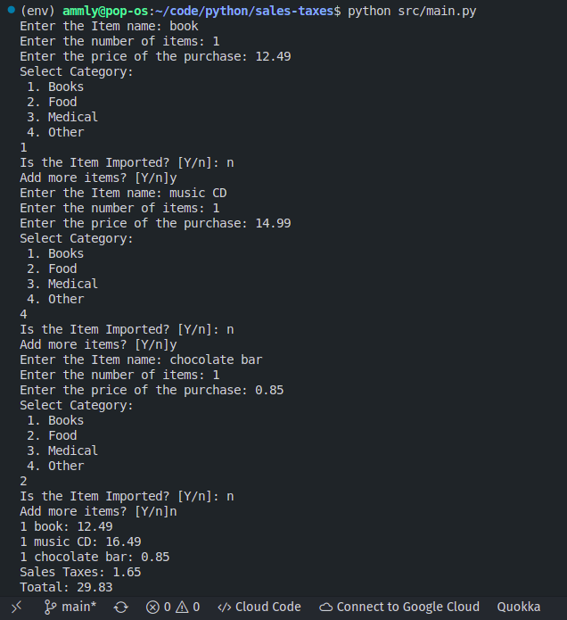

# sales-taxes

sales_taxes take home exercise

## Requirements

1. Python 3

## Instructions

1. Clone this repo ` gh repo clone Ammly/sales-taxes `
2. Change in to that directory ` cd sales-taxes `
3. Run the program ` python src/main.py ` and follow the prompts

## Example (basket #1)

