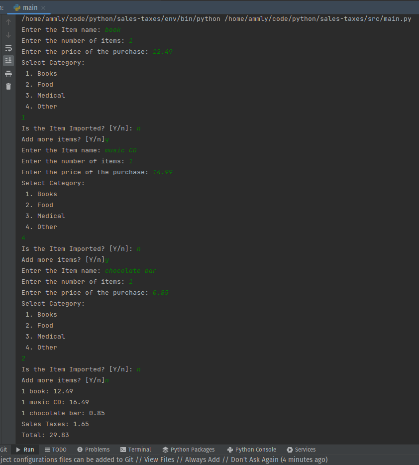

# sales-taxes

sales_taxes take home exercise

## Requirements

1. Python 3

## Instructions

1. Clone this repo 
```shell 
gh repo clone Ammly/sales-taxes
```
2. Change in to that directory
```shell
cd sales-taxes/src
```
3. Run the program and follow the prompts
```shell
python main.py
```
### Tests

Run Unit Tests
```shell
cd sales-taxes/src

python -m unittest test_main.py
```

## Example (basket #1)


